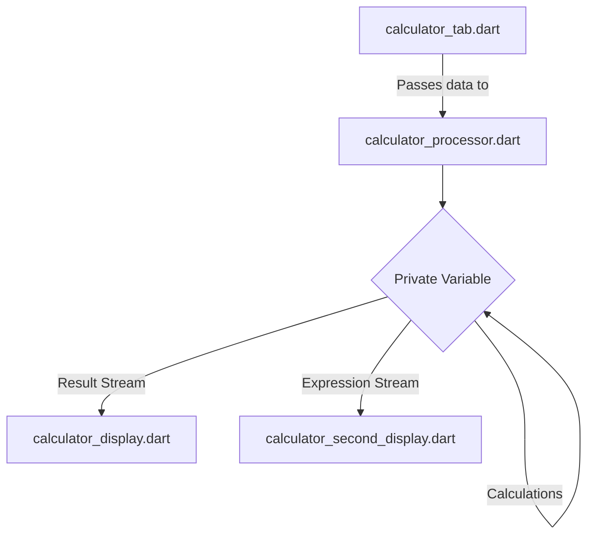
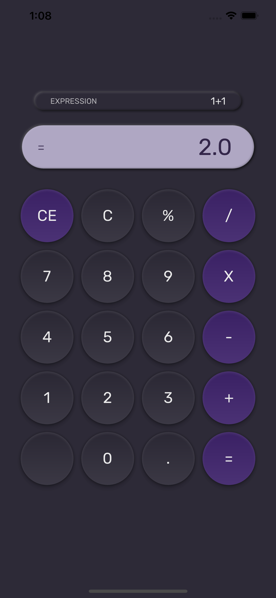

<!-- PROJECT SHIELDS -->
[![Contributors][contributors-shield]][contributors-url]
[![Forks][forks-shield]][forks-url]
[![Stargazers][stars-shield]][stars-url]
[![Issues][issues-shield]][issues-url]
[![MIT License][license-shield]][license-url]


<!-- PROJECT LOGO -->
<br />
<div align="center">

  <h1 align="center">Neumorphic Calculator App</h1>

  <p align="center">
    A user-friendly mobile calculator app for both IOS and Android with a visually pleasing neumorphic design.
    <br />
    <br />
    <a href="#-ui-case-study">View Demo</a>
    ·
    <a href="https://github.com/andreaaazo/neumorphic-calculator/issues">Report Bug</a>
    ·
    <a href="https://github.com/andreaaazo/neumorphic-calculator/issues">Request Feature</a>
  </p>
</div>

<!-- TABLE OF CONTENTS -->
<details>
  <summary>Table of Contents</summary>
  <ol>
    <li>
      <a href="#-about-the-project">About The Project</a>
    </li>
    <li>
      <a href="#-getting-started">Getting Started</a>
    </li>
    <li><a href="#-app-structure--mechanics">App Structure & Mechanics</a></li>
    <li><a href="#-ui-case-study">UI Case Study</a></li>
    <li><a href="#-contributing">Contributing</a></li>
    <li><a href="#-license">License</a></li>
    <li><a href="#-contact">Contact</a></li>
  </ol>
</details>

## 📋 About the project

The Neumorphic Calculator App is a Dart and Flutter-based application that provides a **user-friendly calculator interface** with a visually pleasing **neumorphic design**. The app follows the [Eva Design System](https://colors.eva.design/), predominantly utilizing shades of purple, black, and white to create a sleek and modern aesthetic.

## 🚀 Getting started

To get started with the Neumorphic Calculator App, **follow these steps**:

1. Clone the project repository.
    ```bash
   git clone https://github.com/andreaaazo/neumorphic-calculator.git
   ```
2. Ensure you have **Dart and Flutter** installed on your development environment.
3. Open the project in your preferred **IDE**.
4. Run the **`main.dart`** file or use the following command:
   ```sh
   flutter run
   ```

## 📁 App Structure & Mechanics

The **project structure** is organized as follows:

```bash
.
├── calculator.dart
├── main.dart
├── src
│   ├── components
│   │   ├── container.dart
│   │   └── text_button.dart
│   ├── components.dart
│   ├── styles
│   │   ├── colors.dart
│   │   └── typography.dart
│   ├── styles.dart
│   └── ui.dart
└── widgets
    ├── calculator_display.dart
    ├── calculator_processor.dart
    ├── calculator_second_display.dart
    └── calculator_tab.dart
```

* `calculator.dart` and `main.dart` serve as the **entry points** to the application.
* The `src` directory contains the **user interface-related code**, including design elements, colors, and typography.
* Within `src`, the `components` folder houses the **Design System components**, such as `text_button.dart` and `container.dart`.
* The styles directory within `src` contains `colors.dart`, managing the **app's color palette** based on the [Eva Design System](https://colors.eva.design/), and `typography.dart`, defining the **app's text styles**.
* `components.dart` and `styles.dart` serve as import files to make UI elements accessible throughout the project.
* The `widgets` folder comprises **custom components** used in the app, such as `calculator_display.dart`, `calculator_processor.dart`, `calculator_second_display.dart`, and `calculator_tab.dart`.

The application's logic is separated from the UI, following the **DRY** (Don't Repeat Yourself) and **SOLID** programming principles. The **core logic** resides in `calculator_processor.dart`, which is an abstract class. Data from the `calculator_tab.dart` is passed to `calculator_processor.dart` through a class function, where it is stored in a private variable. **The processor then performs the necessary calculations**.

Here is a diagram illustrating the **data flow** and **handling**:


**To update the UI** with the result and expression, the `calculator_processor.dart` abstract class utilizes **two Streams**. These streams **send the result and expression to** the `calculator_display.dart` and `calculator_second_display.dart` components, respectively, both of which are **listening to the streams**. This allows for **real-time updates** of the displayed data based on the calculations performed by the processor.

## 🎨 UI Case Study

</img>

The Neumorphic Calculator App showcases a **neumorphic user interface design**, which provides an elegant and tactile user experience. The app adheres to the [Eva Design System](https://colors.eva.design/), utilizing a harmonious combination of **purple, black, and white** colors to create a visually appealing interface.

The **Design System components**, including `text_button.dart` and `container.dart`, are carefully crafted to ensure **consistency and reusability** throughout the app. The `colors.dart` file in the styles folder defines the **color palette**, while `typography.dart` handles the **typography choices**, ensuring clear and legible text.

The UI reflects the principles of neumorphism, with subtle shadows and soft edges on interactive elements, resulting in a **modern and visually engaging calculator experience**.

## 🤝 Contributing

Contributions to the Neumorphic Calculator App are **welcome**! If you would like to contribute, please follow these steps:

1. **Fork** the project repository.
2. **Create a new branch** for your feature or bug fix.
3. **Make your changes** and ensure that the code is properly formatted.
4. **Write tests**, if applicable, to maintain code quality.
5. **Submit a pull request**, clearly describing the changes you've made.

## 📄 License

The Neumorphic Calculator App is licensed under the [MIT License](https://opensource.org/license/mit/). You are free to use, modify, and distribute the code for personal or commercial purposes.

## 📞 Contact

If you have any questions, suggestions, or feedback regarding the Neumorphic Calculator App, please feel free to **contact** the project maintainer at zorzi.andrea@outlook.com.


<!-- MARKDOWN LINKS & IMAGES -->
<!-- https://www.markdownguide.org/basic-syntax/#reference-style-links -->
[contributors-shield]: https://img.shields.io/github/contributors/andreaaazo/neumorphic-calculator.svg?style=for-the-badge
[contributors-url]: https://github.com/andreaaazo/neumorphic-calculator/graphs/contributors
[forks-shield]: https://img.shields.io/github/forks/andreaaazo/neumorphic-calculator.svg?style=for-the-badge
[forks-url]: https://github.com/andreaaazo/neumorphic-calculator/network/members
[stars-shield]: https://img.shields.io/github/stars/andreaaazo/neumorphic-calculator.svg?style=for-the-badge
[stars-url]: https://github.com/andreaaazo/neumorphic-calculator/stargazers
[issues-shield]: https://img.shields.io/github/issues/andreaaazo/neumorphic-calculator.svg?style=for-the-badge
[issues-url]: https://github.com/andreaaazo/neumorphic-calculator/issues
[license-shield]: https://img.shields.io/github/license/andreaaazo/neumorphic-calculator.svg?style=for-the-badge
[license-url]: https://github.com/andreaaazo/neumorphic-calculator/blob/master/LICENSE.txt
[product-screenshot]: screenshots/screenshot.png